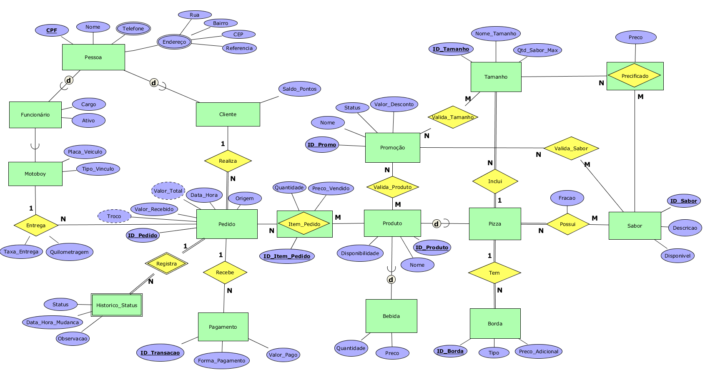

# Documentação do Modelo Conceitual: Pizzaria Madre Querida

## 1. Visão Geral
Este documento detalha a modelagem conceitual da base de dados da pizzaria Madre Querida. A arquitetura foi projetada para suportar uma operação em expansão geográfica (São João del Rei - MG), focando na eliminação de processos manuais e na garantia da integridade transacional.

---

## 2. Entidades e Atributos

### 2.1 Núcleo Transacional e Rastreabilidade
* **Pedido**: Entidade que centraliza a venda.
    * `ID_Pedido` (PK)
    * `Data_Hora_Criacao`: Registro de entrada do pedido.
    * `Status`: Estado atual (Enum: Recebido, Preparo, Aguardando Entrega, Em Rota, Finalizado, Cancelado).
    * `Valor_Total`: Soma líquida dos itens e taxa de entrega.
    * `Valor_Recebido`: Valor bruto dado pelo cliente em mãos.
    * `Troco`: Diferença a ser devolvida ao cliente (calculado: Valor_Recebido - Valor_Total).
    * `Taxa_Entrega`: Custo logístico do deslocamento.
    * `Quilometragem`: Distância percorrida para a entrega.
    * `Pontos_Resgatados`: Quantidade de pontos de fidelidade utilizados como desconto nesta venda.
    * `Origem`: Canal de venda (WhatsApp, Balcão, iFood, Telefone).

* **Historico_Status**: Entidade **fraca** que registra o "ciclo de vida" do pedido.
    * `ID_Historico` (PK)
    * `Status`: O estado para o qual o pedido mudou.
    * `Data_Hora_Mudanca`: Carimbo de tempo preciso da mudança.
    * `Observacao`: Motivo de cancelamentos ou atrasos.

### 2.2 Gestão de Pessoas e Segurança
* **Pessoa (Generalização)**: Base para Clientes e Funcionários.
    * `CPF`: (PK), Identificador único nacional.
    * `Nome`: Nome completo.
    * `Data_Nascimento`: Data para CRM e alertas de aniversário.
    * `Criado_Em`: Data de cadastro inicial.

* **Endereço**: Entidade que suporta múltiplos locais de entrega.
    * `ID_Endereco` (PK)
    * `Logradouro`: Nome da rua/avenida.
    * `Numero`: Número da residência.
    * `Bairro`: Região para cálculo de taxas.
    * `CEP`: Código postal.
    * `Ponto_Referencia`: Contexto para o entregador.
    * `E_Principal`: Define o endereço padrão do cliente.

* **Telefone**: Registro de contatos.
    * `ID_Telefone` (PK)
    * `Numero`: DDD + Número.
    * `E_Principal`: Indica o telefone de contato preferencial.

* **Usuario**: Identidade de acesso ao sistema.
    * `ID_Usuario` (PK)
    * `Username`: Nome de login único.
    * `Senha_Hash`: Senha criptografada.
    * `Role`: Nível de acesso (Admin ou Funcionario).
    * `Ativo`: Status de permissão de login.
    * `Ultima_Login`: Registro cronológico do último acesso.

* **Cliente / Funcionario / Motoboy (Especializações)**:
    * **Cliente**: 
        * `Saldo_Pontos`: Acúmulo de pontos fidelidade.
        * `Observacao`: Notas de CRM (Preferências, alergias).
        * `Ativo`: Se o cliente está apto para compras.
        * `Ultima_Visita`: Data da última compra realizada.
    * **Funcionario**: 
        * `Cargo`: Função ocupada (Pizzaiolo, Atendente, etc). 
        * `Salario`: Remuneração base. 
        * `Data_Admissao`: Data de entrada na equipe.
        * `Ativo`: Status de vínculo com a empresa.
    * **Motoboy**: 
        * `Placa_Veiculo`: Identificação do veículo de entrega. 
        * `Tipo_Vinculo`: Próprio ou Freelancer.

### 2.3 Catálogo e Itens
* **Produto (Generalização)**: Base para Bebidas e Insumos.
    * `ID_Produto` (PK)
    * `Nome`: Nome comercial.
    * `Tipo_Produto`: Categoria (Bebida, Pizza, etc).
    * `Preco_Pontos`: Custo para resgate via fidelidade.

* **Bebida (Especialização)**: 
    * `Quantidade`: Estoque atual disponível.
    * `Preco_Venda`: Valor padrão de venda.
    * `Volume_ML`: Capacidade da embalagem.

* **Pizza**: Item complexo composto por múltiplos sabores e customizações.
    * `Observação`: Instruções de preparo (ex: "sem cebola").

* **Item_Pedido**: Linha da comanda que vincula o pedido ao produto/pizza.
    * `Quantidade`: Volume de unidades vendidas.
    * `Tipo_Item`: Identificador de categoria (Pizza ou Bebida).
    * `Preço_Vendido`: Valor unitário congelado no ato da venda.
    * `Observação`: Notas específicas do item.

* **Sabor**: Definição do recheio da pizza.
    * `ID_Sabor` (PK)
    * `Nome_Sabor`: Nome comercial.
    * `Ingredientes`: Composição para o pizzaiolo.
    * `Disponível`: Status de estoque dos insumos do sabor.
    * `Preco_Pontos`: Custo de resgate específico por sabor.

* **Tamanho**: Dimensões da pizza.
    * `ID_Tamanho` (PK)
    * `Nome_Tamanho`: Broto, Média, Grande, Gigante.
    * `Qtd_Sabor_Max`: Limite de fracionamento (ex: G permite 2 sabores).

* **Borda**: Opcional de crosta recheada.
    * `ID_Borda` (PK)
    * `Tipo`: Chocolate, Catupiry, Cheddar, etc.
    * `Preco_Adicional`: Valor somado ao preço base da pizza.

* **Promoção**: Regras de desconto.
    * `ID_Promo` (PK)
    * `Nome`: Nome da campanha.
    * `Status`: Ativa ou Inativa.
    * `Valor_Desconto`: Valor bruto a ser deduzido.

### 2.4 Módulo Financeiro (Caixa)
* **Caixa**: Sessão diária de movimentação financeira.
    * `ID_Caixa` (PK)
    * `Data_Abertura`: Início do turno.
    * `Data_Fechamento`: Encerramento do turno.
    * `Valor_Abertura`: Fundo de troco inicial.
    * `Valor_Fechamento_Esperado`: Saldo calculado pelo sistema (Abertura + Entradas - Saídas).
    * `Valor_Fechamento_Informado`: Valor contado fisicamente pelo operador.
    * `Status`: Aberto ou Fechado.
    * `Observacao`: Notas de quebra de caixa ou ocorrências.

* **Fluxo_Caixa**: Registro de movimentações individuais.
    * `ID_Movimentacao` (PK)
    * `Tipo_Movimentacao`: Venda, Suprimento (entrada), Sangria (saída), Acerto Motoboy.
    * `Forma_Pagamento`: Dinheiro, Pix, Cartão Crédito, Cartão Débito.
    * `Valor`: Valor da transação.
    * `Descricao`: Motivo detalhado da movimentação.
    * `Data_Hora`: Carimbo de tempo do lançamento.

* **Pagamento**: Vínculo entre o Pedido e o Fluxo de Caixa.
    * `ID_Transacao` (PK)
    * `Forma_Pagamento`: Método utilizado.
    * `Valor_Pago`: Quantia liquidada.

---

## 3. Relacionamentos

| Relacionamento | Entidades Relacionadas | Cardinalidade | Descrição |
| :--- | :--- | :--- | :--- |
| **Opera** | Usuario : Caixa | 1 : N | Um usuário abre/fecha vários caixas (rastreabilidade). |
| **Contém** | Caixa : Fluxo_Caixa | 1 : N | Um caixa agrupa todas as entradas e saídas do turno. |
| **Financeiro** | Pedido : Fluxo_Caixa | 1 : N | Uma venda gera registros no fluxo de caixa (pode ter múltiplas formas de pagto). |
| **Entrega** | Motoboy : Pedido | 1 : N | Um motoboy realiza várias entregas. Atributos: Taxa, KM. |
| **Realiza** | Cliente : Pedido | 1 : N | Um cliente realiza vários pedidos. |
| **Registra** | Pedido : Historico_Status | 1 : N | Entidade Fraca: Armazena o "filme" das mudanças de estado. |
| **Possui** | Item_Pedido : Sabor | N : M | Permite pizzas fracionadas (1/2, 1/3). Atributo: Fracao. |
| **Configura** | Item_Pedido : Tamanho | N : 1 | Cada item pizza tem exatamente um tamanho definido. |
| **Adiciona** | Item_Pedido : Borda | N : 1 | Cada item pizza pode ter uma borda específica. |
| **Aplica** | Promoção : Produto/Sabor | N : M | Define quais itens ativam a promoção. |

---

## 4. Regras de Negócio

1.  **Obrigatoriedade de Caixa**: Não é permitido criar um `Pedido` se não houver um `Caixa` com status `Aberto`.
2.  **Imutabilidade Financeira**: O `Preço_Vendido` no `Item_Pedido` é persistido no momento da criação, protegendo o faturamento histórico contra reajustes de cardápio.
3.  **Auditoria RH**: Toda abertura e fechamento de caixa grava o `ID_Usuario` responsável, permitindo identificar erros de contagem.
4.  **Estoque em Tempo Real**: Vendas de `Bebidas` decrementam automaticamente a `Quantidade` na tabela específica; cancelamentos devolvem o item ao estoque.
5.  **Fidelidade Automática**: O `Saldo_Pontos` do cliente é atualizado proporcionalmente ao `Valor_Total` pago em cada venda (ex: R$ 10,00 = 1 ponto).
