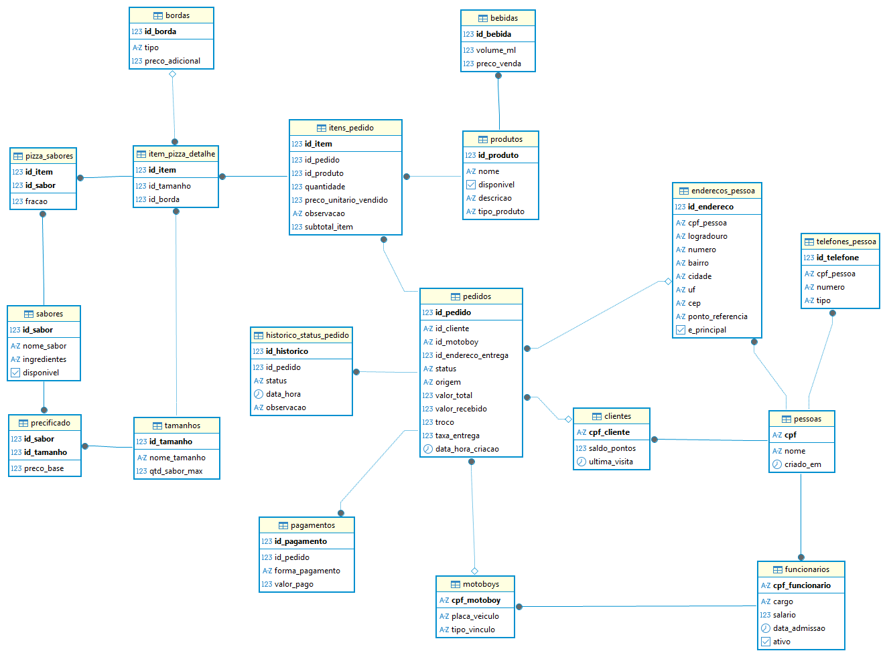

# Documentação Técnica: Modelo Lógico e Físico - Pizzaria Madre Querida

## 1. Visão Geral
Este documento detalha a implementação técnica do banco de dados (V2.2). Enquanto o modelo conceitual foca nas regras de negócio, este modelo foca na **integridade referencial**, **performance** e **normalização** dos dados utilizando PostgreSQL.

---

## 2. Modelo Lógico (Diagrama de Tabelas)

O Modelo Lógico traduz as entidades conceituais em tabelas reais, definindo tipos de dados, chaves primárias (PK) e chaves estrangeiras (FK).



### Principais Decisões Arquiteturais:
*   **Normalização (3FN)**: Atributos multivalorados (como Endereços e Telefones) foram movidos para tabelas separadas para evitar redundância.
*   **Herança de Tabela Única (Partial)**: As especializações (`Clientes`, `Funcionarios`, `Motoboys`) utilizam o CPF como PK e FK simultaneamente para a tabela `Pessoas`, garantindo que um CPF nunca seja duplicado em papéis diferentes de forma inconsistente.
*   **Desmembramento de Pedido**: O relacionamento entre Pedido e Produto foi resolvido através de `itens_pedido`, com tabelas de especialização (`item_pizza_detalhe` e `pizza_sabores`) para lidar com a complexidade de pizzas customizadas sem sobrecarregar itens simples (como bebidas).

---

## 3. Modelo Físico (Implementação SQL)

O modelo físico foi implementado em **PostgreSQL 15** via **Docker**, utilizando recursos avançados para garantir a robustez do sistema.

### 3.1 Tecnologias Utilizadas
*   **PostgreSQL 15**: Motor de banco de dados relacional.
*   **Docker & Docker Compose**: Orquestração do ambiente de desenvolvimento.
*   **TIMESTAMPTZ**: Armazenamento de datas com fuso horário para consistência global.
*   **NUMERIC(10,2)**: Precisão decimal absoluta para valores monetários.

### 3.2 Mecanismos de Integridade e Performance
1.  **Enums (Tipos Customizados)**: Limitação estrita de estados para `status_pedido_enum` e `origem_pedido_enum`, impedindo dados "sujos" no banco.
2.  **Check Constraints**: Travas de segurança que impedem valores negativos em preços e quantidades (`CHECK preco > 0`).
3.  **Índices (B-Tree)**: Criados estrategicamente em colunas de busca frequente (`id_cliente`, `status`, `data_hora`) para garantir respostas rápidas mesmo com grande volume de dados.
4.  **Generated Columns**: A coluna `subtotal_item` na tabela `itens_pedido` é calculada automaticamente pelo banco de dados, garantindo que o valor total do item nunca esteja matematicamente errado.

---

## 4. Dicionário de Dados Resumido

| Tabela | Função |
| :--- | :--- |
| **pessoas** | Base central de dados biográficos (CPF, Nome). |
| **pedidos** | Registro principal de transações e vendas. |
| **historico_status_pedido** | Registro de auditoria (Log) de cada fase do pedido. |
| **itens_pedido** | Registro histórico de cada item vendido (com preço congelado). |
| **precificado** | Matriz de decisão de preços (Cruzamento Sabor x Tamanho). |
| **item_pizza_detalhe** | Atributos específicos para pizzas (Borda, Tamanho). |

---

## 5. Como Executar o Banco
O banco de dados é inicializado automaticamente via Docker Compose.
```bash
# Na pasta /docs
docker compose up -d
```
O script de criação física está localizado em `database/schema.sql` e é montado no volume de inicialização do contêiner.
