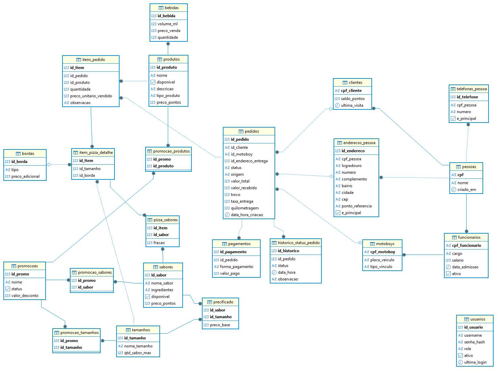

# Documentação do Modelo Lógico: Pizzaria Madre Querida
**Projeto:** Pizzaria Madre Querida  
**SGBD:** PostgreSQL 15  
**Contexto:** Gestão completa de delivery com rastreabilidade operacional e imutabilidade financeira.

---

## 1. Domínios de Dados (Enums)

### `status_pedido_enum`
Controla os estados válidos de um pedido no fluxo operacional.
*   **Recebido**: Pedido registrado, aguardando início da produção.
*   **Em Preparo**: O item está sendo montado ou está no forno.
*   **Aguardando Entrega**: Produção finalizada, aguardando coleta do motoboy.
*   **Em Rota**: Pedido em trânsito (logística externa).
*   **Finalizado**: Pedido entregue e pago.
*   **Cancelado**: Pedido interrompido por erro ou desistência.

### `origem_pedido_enum`
Identifica o canal de entrada da venda para análise de conversão.
*   **WhatsApp**: Venda manual via chat.
*   **Telefone**: Venda manual via voz.
*   **Balcão**: Retirada presencial ou consumo local.
*   **iFood**: Venda via marketplace externo.

---

## 2. Estrutura das Tabelas

### 2.1 Módulo de Identificação

#### Tabela: `pessoas`
Raiz da generalização de seres humanos no sistema.
*   **`cpf`** (VARCHAR(14)): **PK**. Identificador único nacional. Garante que uma mesma pessoa não tenha dois cadastros (como cliente e funcionário) sem histórico unificado.
*   **`nome`** (VARCHAR(100)): **NOT NULL**. Nome completo ou social para tratamento e emissão de notas.
*   **`criado_em`** (TIMESTAMPTZ): Data/hora de entrada no sistema para análise de tempo de casa ou fidelidade.

#### Tabela: `telefones_pessoa`
Implementação do atributo multivalorado para contatos.
*   **`id_telefone`** (SERIAL): **PK**. Identificador técnico do registro.
*   **`cpf_pessoa`** (VARCHAR(14)): **FK** para `pessoas`. Vincula o número ao dono.
*   **`numero`** (VARCHAR(20)): **NOT NULL**. O número com DDD. Crucial para o motoboy contatar o cliente na entrega.
*   **`e_principal`** (BOOLEAN): Define qual telefone exibir como destaque na tela de vendas.

#### Tabela: `enderecos_pessoa`
Entidade fraca que suporta múltiplos locais de entrega.
*   **`id_endereco`** (SERIAL): **PK**. Identificador do local.
*   **`cpf_pessoa`** (VARCHAR(14)): **FK** para `pessoas`. Define a quem pertence o endereço.
*   **`logradouro`** (VARCHAR(100)): Nome da rua/avenida.
*   **`ponto_referencia`** (TEXT): Contexto crucial para cidades com endereçamento complexo.
*   **`e_principal`** (BOOLEAN): Marca o endereço padrão para acelerar o processo de venda.

---

### 2.2 Módulo de CRM e Recursos Humanos

#### Tabela: `clientes`
Especialização da entidade Pessoa focada em consumo.
*   **`cpf_cliente`** (VARCHAR(14)): **PK / FK** para `pessoas`. Herança dos dados básicos.
*   **`saldo_pontos`** (INTEGER): Acúmulo de pontos ganhos em compras pagas para trocas futuras.
*   **`ultima_visita`** (TIMESTAMPTZ): Registro automático da última compra para fins de marketing.

#### Tabela: `funcionarios`
Especialização da entidade Pessoa focada em operação.
*   **`cpf_funcionario`** (VARCHAR(14)): **PK / FK** para `pessoas`. Herança dos dados básicos.
*   **`cargo`** (VARCHAR(50)): Função (Atendente, Pizzaiolo, Gerente).
*   **`salario`** (NUMERIC(10,2)): Valor base da remuneração mensal.

#### Tabela: `motoboys`
Especialização de Funcionário focada em logística.
*   **`cpf_motoboy`** (VARCHAR(14)): **PK / FK** para `funcionarios`. Herança total.
*   **`placa_veiculo`** (VARCHAR(10)): Identificação da moto para segurança e triagem.
*   **`tipo_vinculo`** (VARCHAR(20)): 'Próprio' ou 'Freelancer'. Define se o motoboy recebe por dia ou por entrega.

---

### 2.3 Módulo de Catálogo e Precificação

#### Tabela: `produtos`
Entidade base para qualquer item vendável (Pizza, Bebida, etc).
*   **`id_produto`** (SERIAL): **PK**. Identificador global do item.
*   **`nome`** (VARCHAR(100)): Nome comercial (Ex: "Pizza de Calabresa", "Coca-Cola").
*   **`tipo_produto`** (VARCHAR(20)): Metadado que define o comportamento do item no sistema (P, B ou A).
*   **`preco_pontos`** (INTEGER): Custo em pontos para resgate via programa de fidelidade.

#### Tabela: `bebidas`
Especialização de Produto com atributos específicos de inventário.
*   **`id_bebida`** (INT): **PK / FK** para `produtos`.
*   **`volume_ml`** (INT): Capacidade da embalagem. Diferencia "Lata 350ml" de "Garrafa 2L".
*   **`preco_venda`** (NUMERIC(10,2)): Valor de venda padrão. **CHECK >= 0**.
*   **`quantidade`** (INT): **Estoque Atual**. Quantidade física disponível. **CHECK >= 0** para evitar vendas de itens inexistentes.

#### Tabela: `precificado`
Relacionamento N:M entre Sabor e Tamanho com atributo de valor.
*   **`id_sabor`** (INT): **PK / FK** para `sabores`.
*   **`id_tamanho`** (INT): **PK / FK** para `tamanhos`.
*   **`preco_base`** (NUMERIC(10,2)): O valor da pizza. **Contexto:** Numa pizzaria, o preço não é do sabor nem do tamanho, mas do cruzamento de ambos.

---

### 2.4 Módulo de Vendas e Operação

#### Tabela: `pedidos`
Entidade central que registra o ato da venda.
*   **`id_pedido`** (SERIAL): **PK**. Número da comanda.
*   **`id_cliente`** (VARCHAR(14)): **FK** para `clientes`. Quem está comprando.
*   **`id_motoboy`** (VARCHAR(14)): **FK** para `motoboys`. **Atributo do relacionamento Entrega**. Define quem levará o produto.
*   **`status`** (status_pedido_enum): Estado atual no ciclo de vida.
*   **`valor_total`** (NUMERIC(10,2)): Valor líquido final. **CHECK >= 0**.
*   **`valor_recebido`** (NUMERIC(10,2)): Quanto o cliente deu em mãos. Crucial para o cálculo de troco.
*   **`troco`** (NUMERIC(10,2)): Valor que o motoboy deve devolver. **CHECK >= 0**.
*   **`taxa_entrega`** (NUMERIC(10,2)): **Atributo do relacionamento Entrega**. Custo do deslocamento.
*   **`quilometragem`** (NUMERIC(10,2)): **Atributo do relacionamento Entrega**. Distância para cálculo de produtividade e desgaste.

#### Tabela: `itens_pedido`
Linhas individuais de cada produto dentro de uma comanda.
*   **`id_item`** (SERIAL): **PK**. Identificador da linha.
*   **`id_pedido`** (INT): **FK** para `pedidos`. Agrupador da comanda.
*   **`preco_unitario_vendido`** (NUMERIC(10,2)): **Imutabilidade**. Congela o preço no ato da venda para proteger o histórico financeiro contra reajustes futuros do cardápio.
*   **`observacao`** (TEXT): Customização do item (Ex: "sem cebola"). Instrução para a cozinha.

#### Tabela: `pizza_sabores`
Relacionamento N:M que resolve o fracionamento de pizzas.
*   **`id_item`** (INT): **PK / FK** para `itens_pedido`.
*   **`id_sabor`** (INT): **PK / FK** para `sabores`.
*   **`fracao`** (NUMERIC(3,2)): Define a proporção do sabor. Ex: 1.00 (inteira), 0.50 (meia), 0.33 (um terço).

#### Tabela: `historico_status_pedido`
Entidade fraca de auditoria (O "Filme").
*   **`id_historico`** (SERIAL): **PK**.
*   **`status`** (status_pedido_enum): Estado para o qual o pedido mudou.
*   **`data_hora`** (TIMESTAMPTZ): Carimbo de tempo preciso. Permite calcular o tempo médio de cada etapa (cozinha, entrega).
*   **`observacao`** (TEXT): Motivo da mudança. Essencial em casos de 'Cancelado'.
